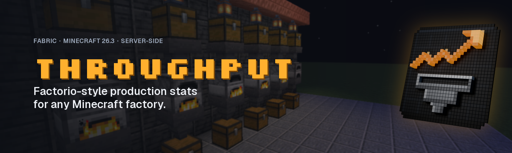
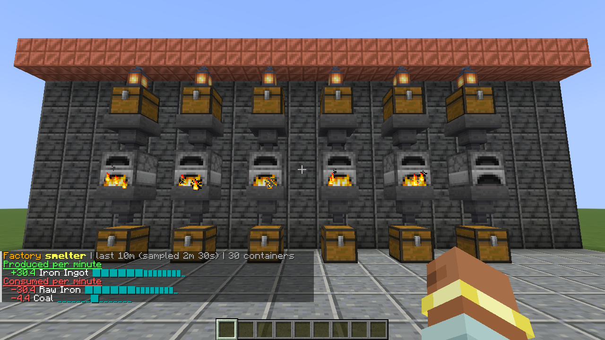
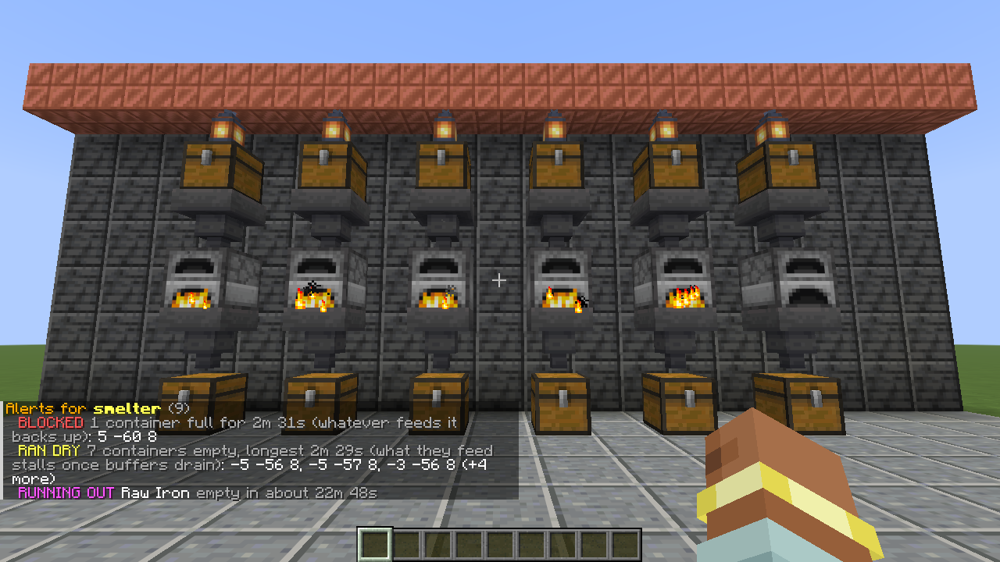
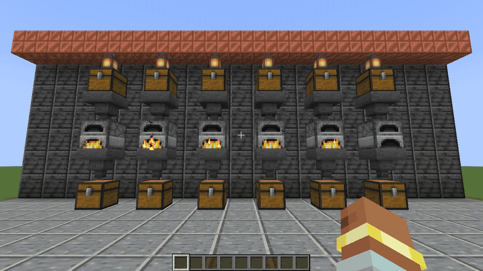
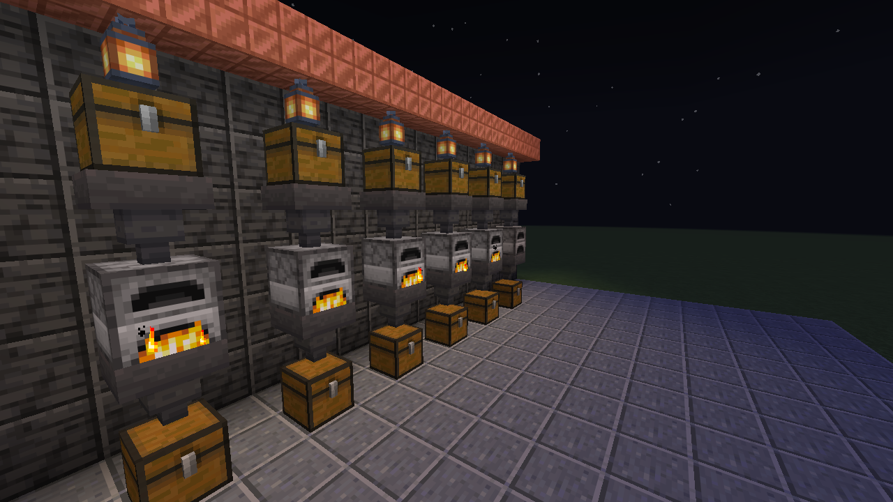
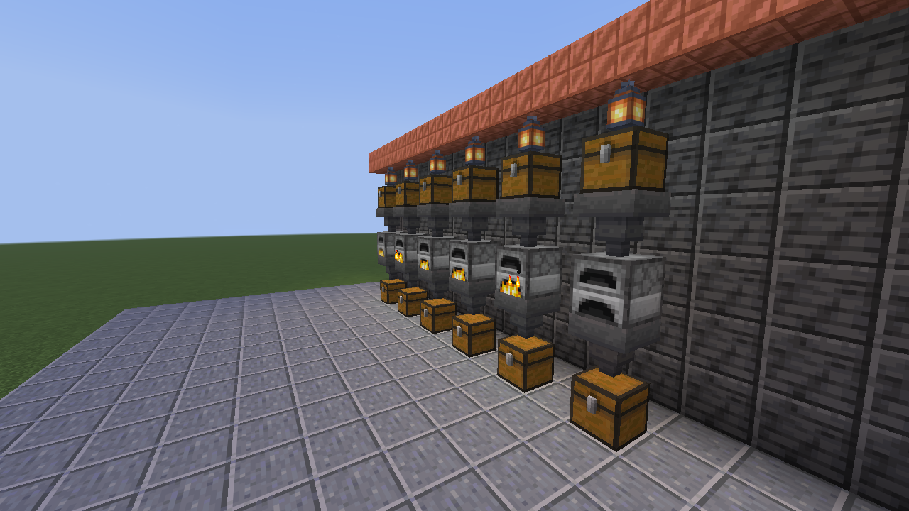
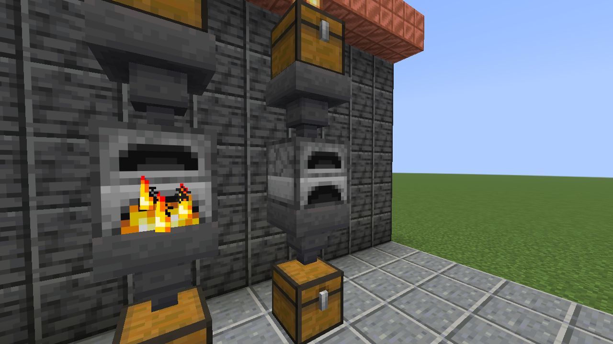

<p align="center">
  
</p>

<p align="center">
  <a href="https://www.curseforge.com/minecraft/mc-mods/throughput"></a>
  <a href="https://github.com/razekteixeira/throughput/actions/workflows/build.yml"></a>
  
  
  <a href="LICENSE"></a>
</p>



Group the chests, furnaces, hoppers and modded storage of a build into a **factory**. Every
second of game time Throughput measures what goes in and out, and tells you:

- **how many per minute** you produce and consume, over 1m, 10m, 1h and 10h windows,
- a **sparkline** of the history next to every item,
- **when an input runs out** ("Raw Iron empty in about 18m 50s"),
- **what is backing up** (full outputs) and **what ran dry** (emptied inputs and buffers),
- a live **action bar ticker** while you build.

It runs on the server only, so players join with an unmodified client. It reads any block that
exposes Fabric item storage, which covers vanilla containers and most tech mods.

| `/flow alerts smelter` | `/flow watch smelter` |
|---|---|
|  |  |

| Night shift | Angled view | Close-up |
|---|---|---|
|  |  |  |

Every screenshot here is a real capture from the game client, produced by
[`ThroughputCaptures`](src/gametest/java/io/github/razekteixeira/throughput/gametest/client/ThroughputCaptures.java).
The 3D logo is rendered in Blender from the icon's own pixels ([`branding/render_logo3d.py`](branding/render_logo3d.py)).

## Commands

`/throughput` and the short alias `/flow` are the same command.

| Command | Permission | What it does |
|---|---|---|
| `/flow factory create <name>` | manage | New factory in your dimension |
| `/flow add <factory> [pos]` | manage | Track the container you look at (double chests: both halves) |
| `/flow addarea <factory> <from> <to>` | manage | Track every container in a box |
| `/flow remove <factory> [pos]` | manage | Stop tracking a container |
| `/flow factory delete <name>` | manage | Delete a factory and its history |
| `/flow factory list` | use | Factories, size, and how long their last sample took |
| `/flow stats <factory> [1m\|10m\|1h\|10h]` | use | Top produced and consumed items with rates and sparklines |
| `/flow alerts <factory> [all]` | use | Blocked, ran dry, missing, running out, grouped by kind |
| `/flow watch <factory>`, `/flow unwatch` | use | Live ticker on your action bar |
| `/flow reload` | admin | Re-read `config/throughput.json` |

### Permissions

With a permissions mod such as LuckPerms, grant the nodes `throughput.use`, `throughput.manage`,
`throughput.coordinates` (see container positions in alerts) and `throughput.admin`. Without one,
the vanilla operator levels from the config apply: use 0, manage 2, coordinates 2, admin 3.

### Configuration

`config/throughput.json` is created on first start with every option:

```json
{
  "sampleIntervalSeconds": 1,
  "alertAfterSeconds": 10,
  "runningOutHorizonMinutes": 60,
  "maxContainersPerFactory": 4096,
  "maxAreaBlocks": 32768,
  "permissionLevels": { "use": 0, "manage": 2, "coordinates": 2, "admin": 3 }
}
```

Out-of-range values are clamped with a warning in the log. A file that cannot be read is
reported and left untouched; the previous settings stay active. With `sampleIntervalSeconds`
above 1, short windows hold only a few samples, so 1m rates move in steps; prefer 10m or longer.

## How it counts

Each tracked container is read once per sample, and the per-container change is added up:

- **Internal moves cancel out.** A hopper moving ore from a tracked chest into a tracked furnace is
  a minus in one place and a plus in the other, so the factory's net does not change.
- **No phantom consumption.** A container that unloads or breaks contributes nothing and shows up
  as MISSING, instead of looking like the factory ate everything.
- **Double chests count once.** Each half is read on its own; adding one half adds both.
- **Game time, saved with the world.** History survives restarts and does not count paused time.
- **Your data is never thrown away.** Data from a newer version, data it cannot parse, and a file
  that cannot be read at all (for example cut short by a crash during a save) are kept byte for
  byte, with a backup copy, and the mod goes read-only instead of letting Minecraft replace them
  with an empty file.

## Performance

Measured with [`tools/benchmark.sh`](tools/benchmark.sh) on a dev server with one factory at the default limit of 4,096 filled chests:
a sample takes a median **1.7 ms** and at worst about 7 ms (Apple M-series, after warm-up, 15 readings), once per second. Each factory
samples on its own tick within the second, so several large factories do not stack up on one
tick. `/flow factory list` shows the last sample time of every factory on your hardware.

## Install

Throughput needs Minecraft **26.3**, [Fabric Loader](https://fabricmc.net/use/) 0.19.5 or newer,
[Fabric API](https://www.curseforge.com/minecraft/mc-mods/fabric-api) and Java 25.

- **Server:** put the Throughput jar and Fabric API in the server's `mods/` folder.
- **Singleplayer:** install Fabric Loader for 26.3 with your launcher, then put both jars in `.minecraft/mods`.

## Building and contributing

```bash
./gradlew build              # compile, 45 unit tests, 8 GameTests on a headless server
./gradlew runServer          # dev server in ./run, no Minecraft account needed
./gradlew runClientGameTest  # real client: regenerates the screenshots (opens a window)
```

JDK 25 is required. See [CONTRIBUTING.md](CONTRIBUTING.md) for the layout, the testing rules and
how releases work.

## License

Apache License 2.0, see [LICENSE](LICENSE). Bundled third-party code is listed in
[THIRD_PARTY_NOTICES.md](THIRD_PARTY_NOTICES.md).

NOT AN OFFICIAL MINECRAFT PRODUCT. NOT APPROVED BY OR ASSOCIATED WITH MOJANG OR MICROSOFT.
